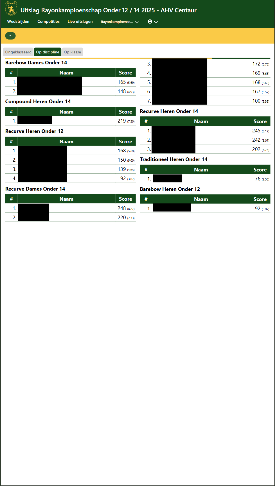

# Version 1.1.6

Date: 10/2/2025

## Backend

This version requires the endpoints added in version 1.1.5 of the backend.

## Results lists

The scores will now be divided equally over multiple columns. Previously the system would prefer to keep scores
for a single group in a single column, but this turned out to give unbdesirable results for compeititons with
many participants. Therefore the new default rendering is to split the content evenly over multiple columns,
preventing orphaning the headings.

## Active list

As of now it's required to select a participant list from the top-menu before competitions or matches can be accessed.

## Verbeterd beheer deelnemers wedstrijden

Als de huidige gebruiker niet is ingelogd, is het niet meer mogelijk om aanpassingen te doen in de scorekaarten, of om een deelnemer van de wedstrijd  
te verbinden met de ledenlijst. De UI liet dit eerder wel toe, terwijl het backend dat weigerde te doen. Nu is het zo dat alle dialogen read-only
zijn wanneer de gebruiker niet is aangemeld.

Wanneer er aan de lijn geen blazoen was geselecteerd konden scores niet worden aangepast. Vanaf deze versie is dit wel mogelijk; de software gaat uit van het eerste beschikbare toetsenbord voor score-invoer als er geen keuze is gemaakt. Dit komt overeen met hoe de software op de tablets is ingericht.
