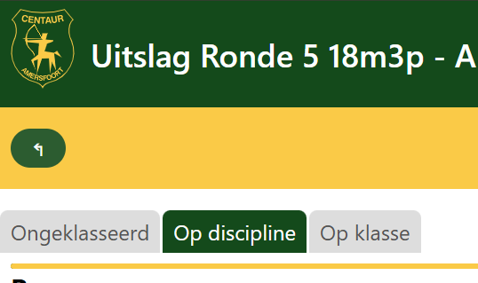
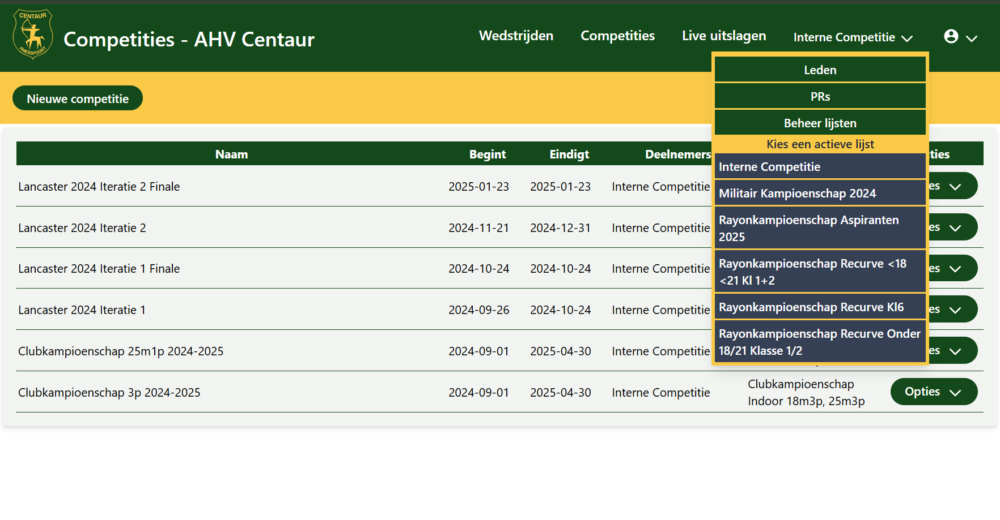

# Release notes

## Version 1.1.23

Added support fordeactivating participant lists.

## Version 1.1.11

Date: 2/17/2025

### Backend version x.y.z

This release requires version x.y.z of the API backend.

### Head to head finals

Added option for creating a head-to-head finals round from a single match result. Using this function will create the match
and will populate the finals for the various classes in that match with archers, based on the result of the match it is created from.
An admin can review the participants prior to creating the finals.

Still to do is a mechnism for creating a final round from scratch or from a competition-result. This should  be deable. Also
to do is setting up competitions over more or less than 4 rounds so one can start with quarter-finals or with 16th finals.

### Visual clean-up

Ensured page navigation sticks to the top. Also made sure error messages are always in view and can be closed so they do
not go unnoticed.

## Version 1.1.10

Date: 2/12/2025

### Backend v 1.1.9

### Configuration

Added configuration page at /config where logged-in users can view and modify system configuration. Currently restricted
to the page title suffix and the footer for the results pages.

## Version 1.1.9

Date: 2/10/2025

### Clean-up

Cleaned up date input to use the standard browser controls. Removed commented-out code. Remoced autocomplete, spell checking 
and auto capitalize from the input fields.

## Version 1.1.8

Date: 2/10/2025

### Backend v 1.1.7

This version requires the endpoints added in version 1.1.7 of the backend.

### Result list add intermediate results

When a match is over more than 10 ends, then for each group of 10 ends the intermediate result is added to the results view.

## Version 1.1.7

Date: 2/10/2025

### Backend v 1.1.6

This version requires the endpoints added in version 1.1.6 of the backend.

### Result list active tab

For live scoring, the active tab on the result list will now follow the active tab chosen for this list in any
of the systems. These will all eb synchronized to the latest choice. This allows you to change the view of
all connected displays centrally.

## Version 1.1.6

Date: 2/10/2025

### Backend

This version requires the endpoints added in version 1.1.5 of the backend.

### Results lists

The scores will now be divided equally over multiple columns. Previously the system would prefer to keep scores
for a single group in a single column, but this turned out to give unbdesirable results for compeititons with
many participants. Therefore the new default rendering is to split the content evenly over multiple columns,
preventing orphaning the headings.

### Active list

As of now it's required to select a participant list from the top-menu before competitions or matches can be accessed.

### Verbeterd beheer deelnemers wedstrijden

Als de huidige gebruiker niet is ingelogd, is het niet meer mogelijk om aanpassingen te doen in de scorekaarten, of
om een deelnemer van de wedstrijd te verbinden met de ledenlijst. De UI liet dit eerder wel toe, terwijl het backend
dat weigerde te doen. Nu is het zo dat alle dialogen read-only zijn wanneer de gebruiker niet is aangemeld.

Wanneer er aan de lijn geen blazoen was geselecteerd konden scores niet worden aangepast. Vanaf deze versie is
dit wel mogelijk; de software gaat uit van het eerste beschikbare toetsenbord voor score-invoer als er geen keuze
is gemaakt. Dit komt overeen met hoe de software op de tablets is ingericht.
